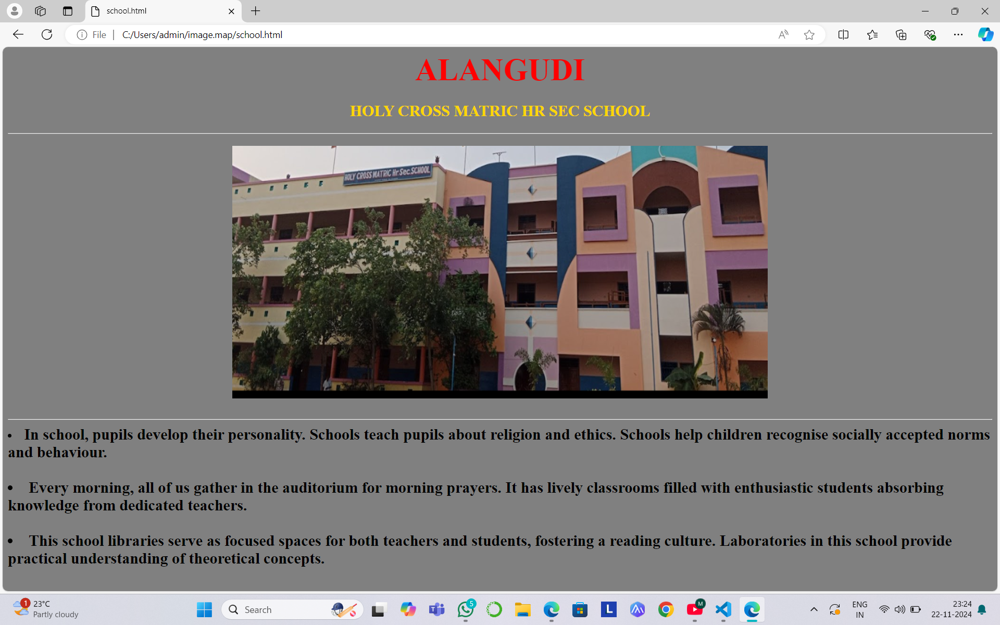
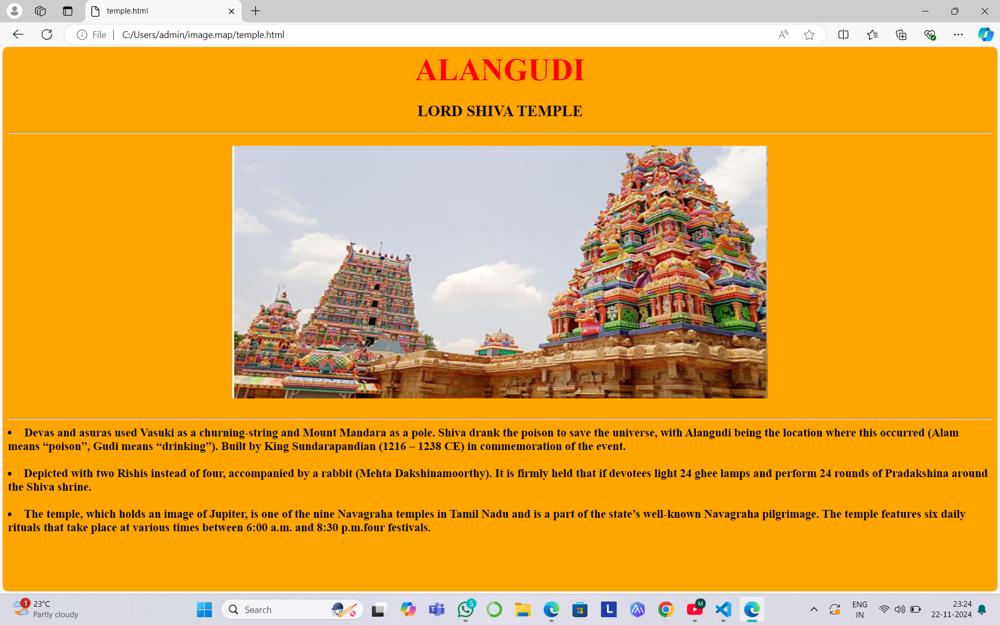
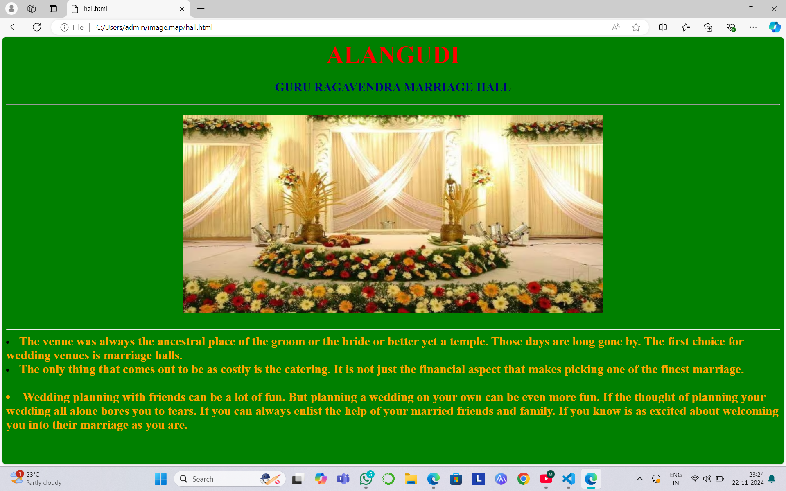
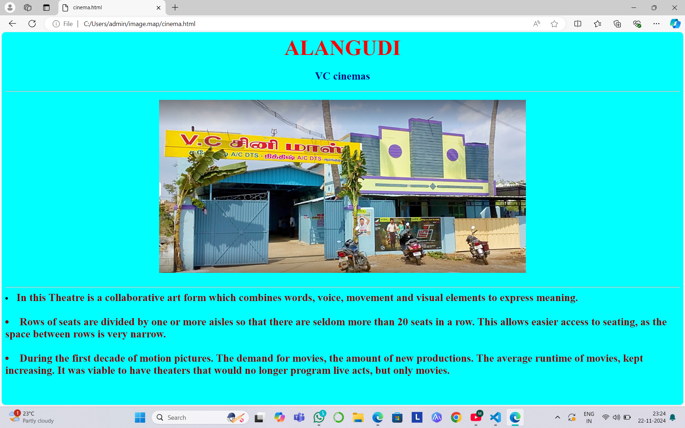
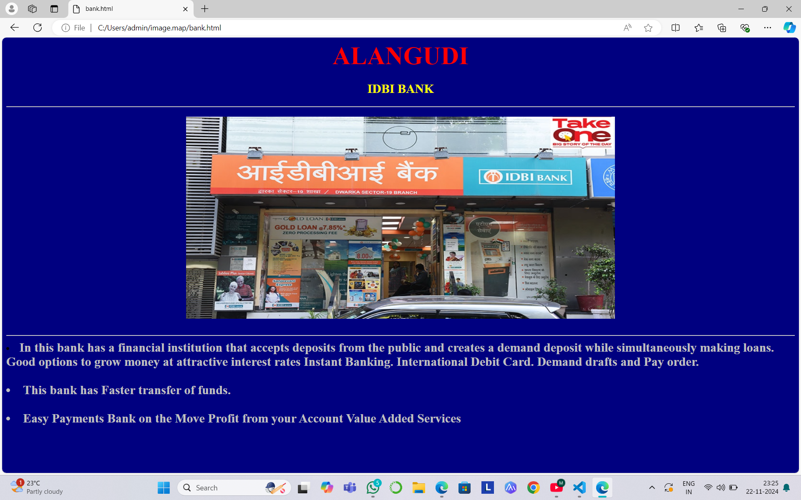

# Ex04 Places Around Me
## Date: 23-11-2024

## AIM
To develop a website to display details about the places around my house.

## DESIGN STEPS

### STEP 1
Create a Django admin interface.

### STEP 2
Download your city map from Google.

### STEP 3
Using ```<map>``` tag name the map.

### STEP 4
Create clickable regions in the image using ```<area>``` tag.

### STEP 5
Write HTML programs for all the regions identified.

### STEP 6
Execute the programs and publish them.

## CODE
```
imagemap.html

<html>
    <body>
        <center>
            <font color="red">
        <h1>
            ALANGUDI 
            <br>
            YUGESH M(24900164)
        </h1>
            </font>
        <br>
        <br>
<center>
    

    <map name="image-map">
        <area target="" alt="HOLY CROSS MATRIC HR SEC SCHOOL" title="HOLY CROSS MATRIC HR SEC SCHOOL" href="school.html" coords="100,22,239,72" shape="rect">
        <area target="" alt="VC cinemas" title="VC cinemas" href="cinema.html" coords="347,436,445,465" shape="rect">
        <area target="" alt="LORD SHIVA TEMPLE" title="LORD SHIVA TEMPLE" href="temple.html" coords="260,524,408,562" shape="rect">
        <area target="" alt="GURU RAGAVENDRA HALL" title="GURU RAGAVENDRA HALL" href="hall.html" coords="689,531,812,585" shape="rect">
        <area target="" alt="IDBI BANK" title="IDBI BANK" href="bank.html" coords="838,544,926,577" shape="rect">
    </map>
</body>
</html>


school.html

<html>
<body bgcolor="grey">
    <h1 align="center">
        <font  size="10" color="red">
            ALANGUDI
        </font>
    </h1>
    <h2 align="center">
        <font color="gold">
        HOLY CROSS MATRIC HR SEC SCHOOL
        </font>
    </h2>
    <hr>
    <h3>
        <center> 
        
        </center>
        <br>
        <hr>
        <li>
            <font size="5">
                In school, pupils develop their personality.
                Schools teach pupils about religion and ethics.
                Schools help children recognise socially accepted norms and behaviour.
        </li>
        <br>
        <li>
            <font size="5">
                Every morning, all of us gather in the auditorium for morning prayers.
                It has lively classrooms filled with enthusiastic students absorbing knowledge from dedicated teachers. 
            </font>
        </li>
        <br>
        <li>
            <font size="5">
               This school libraries serve as focused spaces for both teachers and students, fostering a reading culture.
               Laboratories in this school provide practical understanding of theoretical concepts.
            </font>
        </li>
    </h3>
</body>

</html>

temple.html

<html>
<body bgcolor="orange">
    <h1 align="center">
        <font  size="10" color="red">
            ALANGUDI
        </font>
    </h1>
    <h2 align="center">
        
        LORD SHIVA TEMPLE
    
    </h2>
    <hr>
    <h3>
        <center> 
        
        </center>
        <br>
        <hr>
        <li>
            <font size="4">
                Devas and asuras used Vasuki as a churning-string and Mount Mandara as a pole.
                Shiva drank the poison to save the universe, with Alangudi being the location where this occurred (Alam means “poison”, Gudi means “drinking”).
                Built by King Sundarapandian (1216 – 1238 CE) in commemoration of the event.
                
        </li>
        <br>
        <li>
            <font size="4">
                Depicted with two Rishis instead of four, accompanied by a rabbit (Mehta Dakshinamoorthy).
                It is firmly held that if devotees light 24 ghee lamps and perform 24 rounds of Pradakshina around the Shiva shrine.
            </font>
        </li>
        <br>
        <li>
            <font size="4">
                The temple, which holds an image of Jupiter, is one of the nine Navagraha temples in Tamil Nadu and is a part of the state’s well-known Navagraha pilgrimage.
                The temple features six daily rituals that take place at various times between 6:00 a.m. and 8:30 p.m.four festivals.
 
            </font>
        </li>
    </h3>
</body>

</html>

hall.html

<html>
<body bgcolor="green">
    <h1 align="center">
        <font  size="10" color="red">
            ALANGUDI
        </font>
    </h1>
    <h2 align="center">
        <font color="navy">
        GURU RAGAVENDRA MARRIAGE HALL
        </font>
    </h2>
    <hr>
    <h3>
        <center> 
        
        </center>
        <br>
        <hr>
        <li>
            <font size="5"color="orange">
                The venue was always the ancestral place of the groom or the bride or better yet a temple.
                Those days are long gone by. 
                The first choice for wedding venues is marriage halls. 
        <br>
        <li>
            <font size="5" color="orange">
                The only thing that comes out to be as costly is the catering.
                 It is not just the financial aspect that makes picking one of the finest marriage. 
            </font>
        </li>
        <br>
        <li>
            <font size="5" color="orange">
            Wedding planning with friends can be a lot of fun.
             But planning a wedding on your own can be even more fun. 
             If the thought of planning your wedding all alone bores you to tears.
             It you can always enlist the help of your married friends and family. 
             If you know is as excited about welcoming you into their marriage as you are.
              
                
            </font>
        </li>
    </h3>
</body>

</html>

cinema.html

<html>
<body bgcolor="aqua">
    <h1 align="center">
        <font  size="10" color="red">
            ALANGUDI
        </font>
    </h1>
    <h2 align="center">
        <font color="navy">
        VC cinemas
        </font>
    </h2>
    <hr>
    <h3>
        <center> 
        
        </center>
        <br>
        <hr>
        <li>
            <font size="5"color="maroon">
             In this Theatre is a collaborative art form which combines words, voice, movement and visual elements to express meaning. 
        </li>
        <br>
        <li>
            <font size="5" color="maroon">
                Rows of seats are divided by one or more aisles so that there are seldom more than 20 seats in a row. 
                This allows easier access to seating, as the space between rows is very narrow. 
            </font>
        </li>
        <br>
        <li>
            <font size="5" color="maroon">
                During the first decade of motion pictures.
                The demand for movies, the amount of new productions.
                The average runtime of movies, kept increasing.
                It was viable to have theaters that would no longer program live acts, but only movies.
            </font>
        </li>
    </h3>
</body>

</html>

bank.html

<html>
<body bgcolor="navy">
    <h1 align="center">
        <font  size="10" color="red">
            ALANGUDI
        </font>
    </h1>
    <h2 align="center">
        <font color="yellow">
        IDBI BANK
        </font>
    </h2>
    <hr>
    <h3>
        <center> 
        
        </center>
        <br>
        <hr>
        <li>
            <font size="5"color="silver">
            In this bank has a financial institution that accepts deposits from the public and creates a demand deposit while simultaneously making loans.
            Good options to grow money at attractive interest rates Instant Banking.
            International Debit Card.
            Demand drafts and Pay order. 
        </li>
        <br>
        <li>
            <font size="5" color="silver">
                This bank has Faster transfer of funds. 
            </font>
        </li>
        <br>
        <li>
            <font size="5" color="silver">
                Easy Payments
                Bank on the Move
                Profit from your Account
                Value Added Services
            </font>
        </li>
    </h3>
</body>

</html>

```

## OUTPUT





## RESULT
The program for implementing image maps using HTML is executed successfully.
